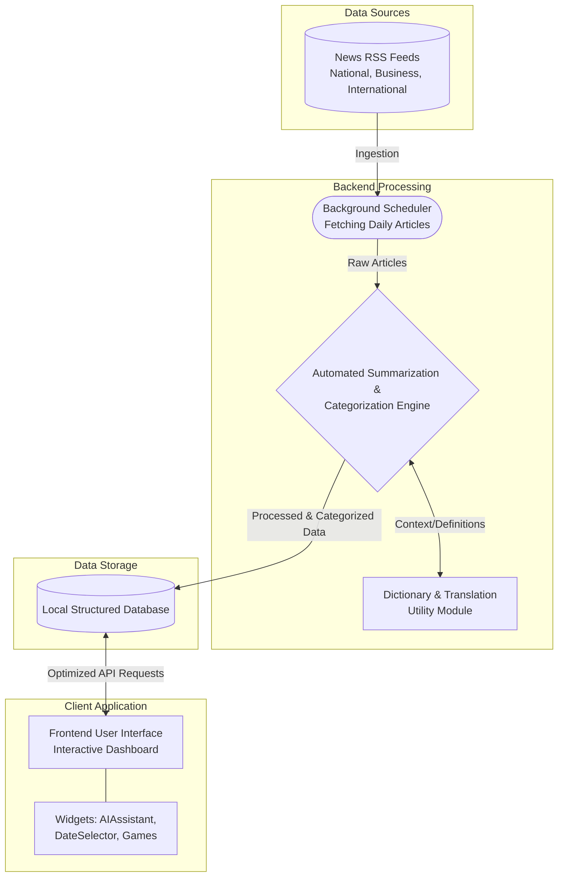
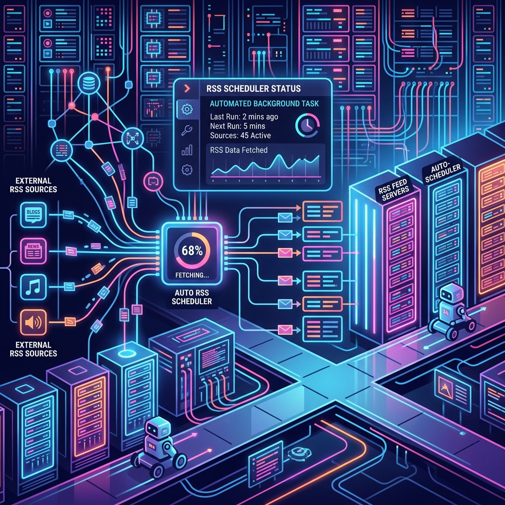
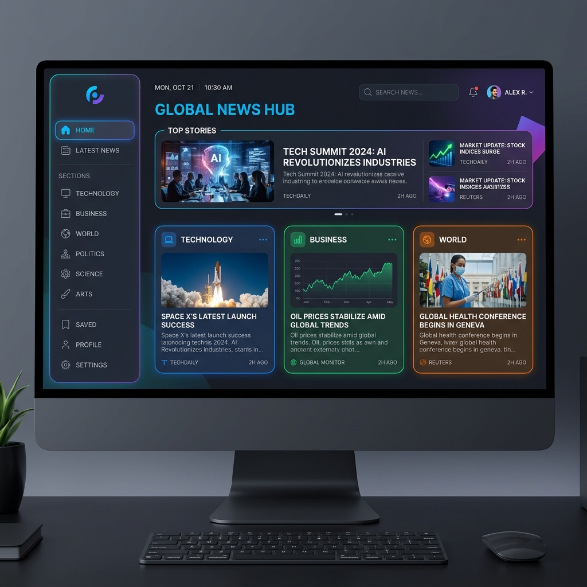

# News Digest

News Digest is a daily, curated news digest designed specifically for MBA and CAT aspirants to maximize their current affairs knowledge and interview preparation. The platform leverages an **Automated AI Editorial Layer** to synthesize, categorize, and deliver essential insights without overwhelming the reader.

## 🚀 Application Architecture & Workflow

The daily batch processing flow operates seamlessly in the background, ingesting and structuring news before it reaches the client. Below is a detailed flowchart of our architecture.



### Visual Step-by-Step Workflow

**Step 1: Data Ingestion & Scheduling**  
The backend background scheduler systematically fetches daily articles from various National, Business, and International RSS feeds without human intervention.


**Step 2: AI Processing & Categorization**  
The automated AI engine digests the raw text, applying dictionary definitions, translation modules, and intelligent summarization. It categorizes the processed data and securely stores it in a structured database.


**Step 3: Interactive Dashboard UI**  
The optimized data is delivered to a highly responsive, Next-Generation frontend application where users can explore the categorized news, converse with the embedded AI assistant, and engage with mini-games.


## 📂 Comprehensive Directory Structure

The workspace strictly isolates the backend processing engine from the frontend client to maintain a clean, secure, and scalable architecture. 

```text
cat-news-digest/
├── backend/                  # Application Backend Engine
│   ├── database.py           # Database connection and configuration
│   ├── main.py               # Main API Endpoints & Task Scheduler
│   ├── news-env/             # Local Virtual Environment (generated)
│   ├── schemas.py            # Data validation structures
│   ├── services.py           # Core business logic: RSS parsing, Dictionary & AI Processing
│   ├── requirements.txt      # Backend dependencies
│   └── .env                  # Private environment variables (API Keys, etc.)
├── src/                      # Frontend Application Client
│   ├── app/                  # Core routing and views
│   │   ├── globals.css       # Global styling
│   │   ├── layout.tsx        # Base layout wrapper
│   │   └── page.tsx          # Main dashboard entry point
│   ├── auth.ts               # Authentication logic and configuration
│   ├── components/           # Reusable UI components
│   │   ├── AIAssistant.tsx   # Integrated AI Chat component
│   │   ├── DateSelector.tsx  # Interactive date navigation
│   │   ├── NewsCard.tsx      # Display component for individual news
│   │   ├── Sidebar.tsx       # Application navigation
│   │   └── games/            # Interactive mini-games (e.g., Bizdle)
│   ├── proxy.ts              # API routing proxy
│   ├── types/                # Type definitions for client
│   └── utils/                # Helper functions and utilities
├── public/                   # Static assets (images, icons)
├── package.json              # Frontend package configuration and scripts
└── README.md                 # Project documentation
```

## ⚙️ Step-by-Step Execution Guide

Follow these comprehensive steps for a complete local deployment.

### 1. Backend Setup (Processing Engine)

1. **Navigate to the backend directory:**
   ```bash
   cd backend
   ```
2. **Initialize a local virtual environment:**
   Create an isolated environment to manage dependencies securely.
   ```bash
   python -m venv news-env
   ```
3. **Activate the virtual environment:**
   - **Windows:** `news-env\Scripts\activate`
   - **macOS/Linux:** `source news-env/bin/activate`
4. **Install backend dependencies:**
   Install the required processing packages.
   ```bash
   pip install -r requirements.txt
   ```
5. **Configure the environment variables:**
   Ensure your `.env` file is properly populated with your private configurations (e.g., API keys).
6. **Start the engine:**
   Launch the backend server.
   ```bash
   python main.py
   # Alternatively, use uvicorn if configured: uvicorn main:app --host 0.0.0.0 --port 8000
   ```

### 2. Frontend Setup (Client UI)

1. **Navigate to the root directory:**
   Ensure you are in the main `cat-news-digest/` folder.
2. **Install frontend dependencies:**
   Install the necessary UI packages.
   ```bash
   npm install
   ```
3. **Configure Frontend Environment:**
   Create or verify `.env.local` to match the required API endpoints or authentication secrets.
4. **Launch the client development server:**
   ```bash
   npm run dev
   ```
5. **Access the application:**
   Open your browser and navigate to `http://localhost:3000`.

### 3. Alternative Quick-Start
If the backend virtual environment `news-env` is already configured, you can run both simultaneously from the root directory (on Windows) using the provided script:
```bash
# Start backend (requires 'news-env' to exist in backend folder)
npm run backend

# In a separate terminal, start frontend
npm run dev
```

## ☁️ Deployment

### Deploying the Frontend to Vercel

This repository is configured for a frontend-only deployment to Vercel. The backend (Python API) is intentionally excluded from the Vercel build process to keep the deployment lightweight and focused on the Next.js client.

**Why is the backend excluded?**
The Next.js frontend is deployed as a standalone application on Vercel. The backend is excluded from this deployment process using the `.vercelignore` file to prevent Vercel from attempting to process or build Python server files and their virtual environments.

**Deployment Steps:**
1. Push your repository to GitHub.
2. Go to your [Vercel Dashboard](https://vercel.com/dashboard) and click **Add New Project**.
3. Import this repository.
4. Vercel will automatically detect the Next.js framework. It will use the settings provided in `vercel.json`:
   - Build Command: `next build`
   - Output Directory: `.next`
   - Install Command: `npm install`
5. **Important:** Add the following Environment Variable in the Vercel project settings before deploying:
   - `NEXT_PUBLIC_API_URL`: Set this to your production backend URL (e.g., `https://your-production-backend.com`). Do NOT use `localhost` or `127.0.0.1`.
6. Click **Deploy**.

## 🛠️ Additional Built-in Utilities

To maximize efficiency and save on API quotas during interview preparation, this application includes fully built-in, local, keyless utilities:
- **Dictionary Lookups:** Utilizes a standard Oxford-style structure for instantaneous word definitions.
- **Language Translation:** Embedded translation tools allow users to seamlessly read and comprehend regional terms without relying on external, paid APIs.
- **Gamified Learning:** Mini-games like *Bizdle* are integrated directly into the client to reinforce business concepts and vocabulary.
